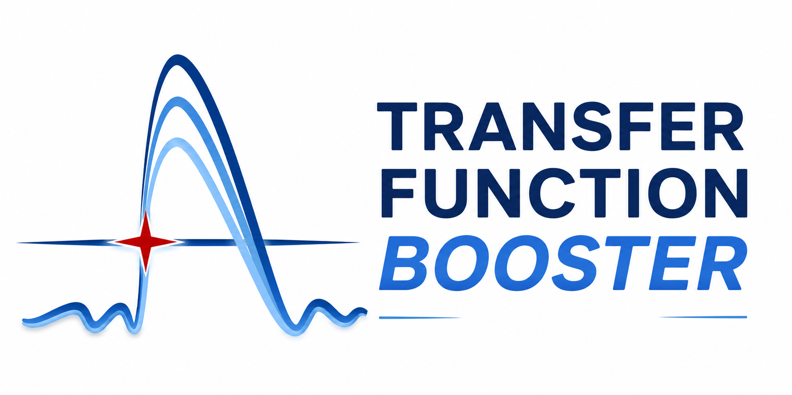
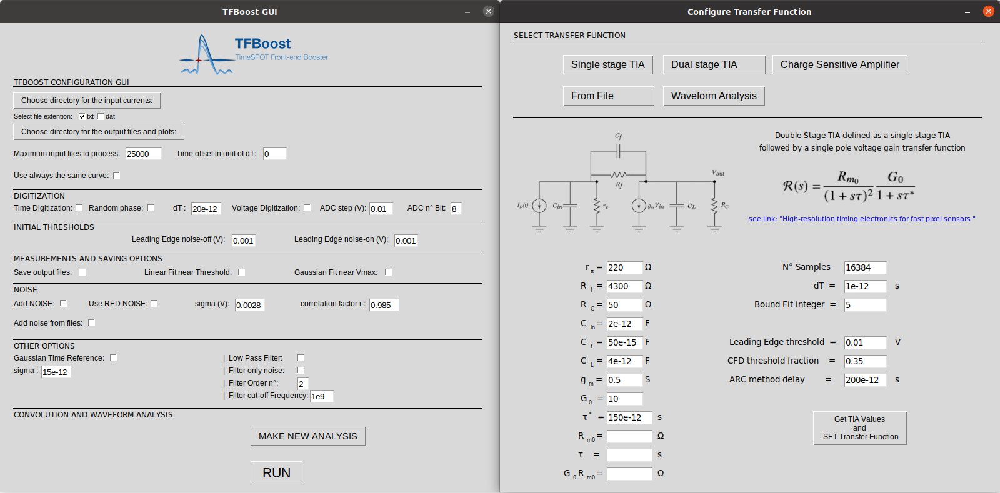
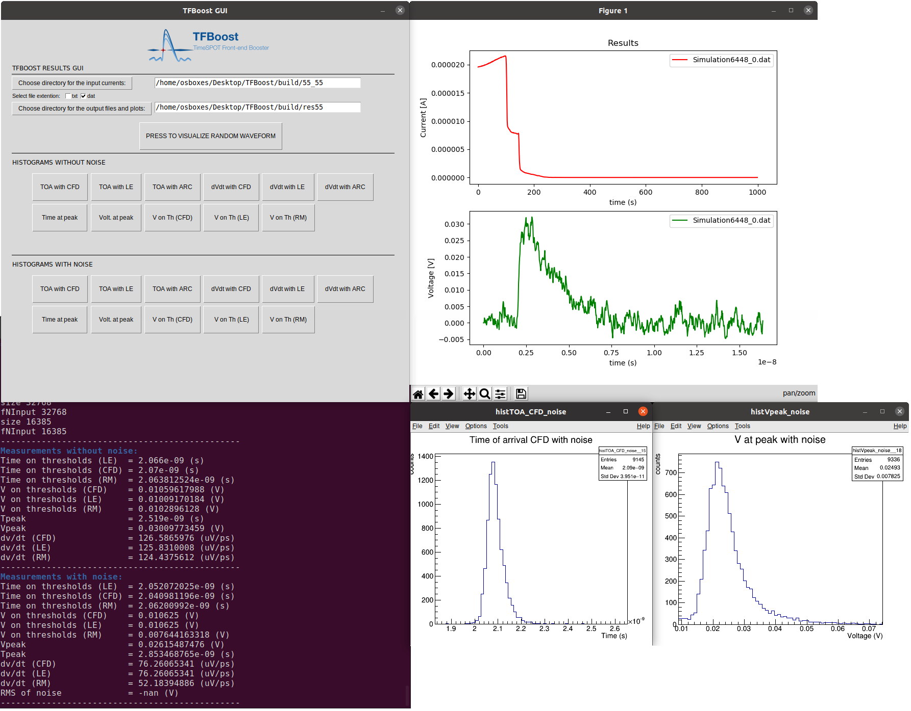

## TFBoost
[](https://www.gnu.org/licenses/gpl-3.0)


[](https://doi.org/10.5281/zenodo.4265385)




TFBoost (Transfer Function Booster) is a C++20 compliant application and library, based on the [HYDRA](https://github.com/MultithreadCorner/Hydra) framework, with a functional software architecture ("Functional Core, Imperative Shell" pattern), to perform convolution between a waveform signal, e.g. a voltage or current signal from a physical sensor, and a transfer function describing a signal analyzer system, e.g. a readout or front-end electronics. The convolution is computed in massively parallel platforms on Linux systems. The transfer function can be modelled starting from a file, as a set of sampling points, or can be chosen from a set of fully configurable analytical functions defined within the library.

The available transfer functions are:
- Two Transimpedance, with 1 and 2 stages,
- CSA,
- Ideal integrator, described as the input impedance of a CSA,
- Order-n Butterworth filter,
- RC filter.

The input waveform signals are read from files as a set of sampling points. The application performs also a set of measurements on the convoluted output signals such as: arrival time, with leading edge and constant fraction discrimination, maximum value and its corresponding time, slope and voltage on discrimination thresholds, etc. Morover a simulated noise, with white or red spectrum, can be added to the output signal. The computation of the convolution can be turned off, and the set of measurements can thus be applied to real signals too.

TFBoost has also a Graphical User Interface written in Python3:




Within the [TCoDe](https://github.com/MultithreadCorner/TCode) application, developed within the TIMESPOT collaboration to simulate the response of solid state sensors, TFBoost is part of a complete software framework for simulation of signals in solid state detectors, from the generation in the sensor to the output of the readout electronics.


## Quick start

Clone the repository and run the launcher — it takes you straight to a running TFBoost GUI:

```bash
git clone https://github.com/dbrundu/TFBoost.git
cd TFBoost
./start.sh
```

`start.sh` chooses the best available route automatically:

- **If `podman` or `docker` is installed** it builds a self-contained image — ROOT and every dependency are bundled, nothing else to install — and launches the **GUI** from it. The first build pulls a ROOT base image and can take a few minutes; later runs reuse the image.
- **Otherwise** it installs the system dependencies (Fedora `dnf` or Debian/Ubuntu `apt`), builds TFBoost, and launches the GUI natively.

Handy options: `./start.sh --native` (skip the container), `./start.sh --rebuild` (force a fresh image/build), `./start.sh --analysis` (container route: run the analysis backend headlessly on `./data` instead of the GUI). Input signals you want the container to see go in `./data/input`; results appear in `./data/results`. See [install/DOCKER.md](install/DOCKER.md) for container details and GUI/X11 troubleshooting.

The rest of this document covers manual dependency installation and building, for full control over the toolchain.


## Dependencies
TFBoost depends on [HYDRA](https://github.com/MultithreadCorner/Hydra) (header-only, tested with 4.x), [ROOT >= v.6.14](https://github.com/root-project/root), [libconfig >= v1.5](https://hyperrealm.github.io/libconfig/) (C++ bindings), [TCLAP >= v1.2.1](http://tclap.sourceforge.net/) and [FFTW3](http://www.fftw.org/). For the best performances at least TBB or OMP backends are needed. Optionally [CUDA >= 10.0](https://developer.nvidia.com/cuda-toolkit) is needed for nVidia GPUs. A C++20-capable compiler (recent [GCC](https://gcc.gnu.org/), Clang or ICC) and [CMake >= v.3.24](https://cmake.org/) are needed.

Two of these dependencies are header-only / source distributions and are *not* installed through the system package manager:

- **HYDRA** is header-only: just clone it (see [Installation, Build and Run](#installation-build-and-run)) and point `HYDRA_INCLUDE_DIR` to it. No build or install step is required.
- **ROOT** must be installed separately (from the [official binaries/packages](https://root.cern/install/) or built from source) and its environment sourced so that `root-config` is on the `PATH` and `ROOTSYS` is set:
  ```bash
  source <path-to-root>/bin/thisroot.sh
  ```

### Installing the system packages

The remaining dependencies (libconfig C++ bindings, TCLAP, FFTW3, the TBB/OpenMP backends and the build toolchain) are available from the system package manager. **For libconfig and TBB make sure to install the development (`-devel` / `-dev`) packages**: the runtime shared libraries alone are not enough, as CMake needs the headers (e.g. `libconfig.h++`) to configure the build.

On **Fedora / RHEL / CentOS** (`dnf`):
```bash
sudo dnf install gcc-c++ cmake libconfig-devel tclap tbb-devel fftw-devel
```

On **Debian / Ubuntu** (`apt`):
```bash
sudo apt install g++ cmake libconfig++-dev libtclap-dev libtbb-dev libfftw3-dev
```

OpenMP support ships with GCC/Clang, so no extra package is needed for the OMP backend. The CUDA backend is built only when the CUDA toolkit is detected; it can be installed separately following the [NVIDIA instructions](https://developer.nvidia.com/cuda-downloads).

> **Note on recent TBB (oneTBB):** modern distributions ship oneTBB (>= 2021), which still works but no longer provides the legacy `tbb/tbb_stddef.h` header. The bundled `cmake/FindTBB.cmake` already handles this; if you use an older/custom TBB finder and configuration fails on a missing `tbb_stddef.h`, this is the cause.


## Manual installation and build
If you prefer to build by hand (rather than using `./start.sh`), first install
the [dependencies](#dependencies) above, then checkout
[HYDRA](https://github.com/MultithreadCorner/Hydra) and TFBoost:
```bash
mkdir <TFBoostDev>
cd <TFBoostDev>
git clone https://github.com/MultithreadCorner/Hydra.git Hydra
git clone https://github.com/gianmatteocossu/TFBoost.git TFBoost
```

Then set up the proper environment variables (use a C++20-capable compiler and a
ROOT whose environment has been sourced):
```bash
export CC=$(command -v gcc) CXX=$(command -v g++)
export ROOTSYS=<path-to-root>            # after: source <path-to-root>/bin/thisroot.sh
export HYDRA_INCLUDE_DIR=<path-to-hydra>
```

Starting from the TFBoost folder, please create a `build` directory for convenience and run the cmake command:
```bash
cd TFBoost
mkdir build
cd build
cmake -DHYDRA_INCLUDE_DIR=$HYDRA_INCLUDE_DIR ../
```

At this point you can run the examples: please read at the examples section for a description on how to setup and run them. If you want to run the actual application please setup the proper configuration using the file `configuration.cgf` inside the `etc/` folder, then build and run the application as:
```bash
make analysis_tbb
./analysis_tbb 
```
to build all the applications needed for the GUI:
```bash
make analysis_tbb deconvolution_tbb resampling_tbb 3Ddiamond_tbb
```
to run TFBoost using the GUI, open a terminal in the `gui/` folder and type:
```bash
cd gui
python3 TFBoostGui.py
```

## Run with a container (Docker / Podman)
The fastest way to run TFBoost without installing any dependency is the bundled
container image. It starts from a base image that already ships **ROOT** (so ROOT
is *not* recompiled), pulls in the remaining dependencies, builds the parallel
(TBB) backends, and can either run a chosen backend or launch the **GUI**. It
works the same with `docker` or `podman`.

`./start.sh` already does the build + GUI launch for you; the commands below are
for driving the image directly.

Build the image from the repository root (the `Dockerfile` lives in `install/`):
```bash
podman build -f install/Dockerfile -t tfboost .
```

Launch the GUI from the container (needs an X server; `start.sh` wires this up):
```bash
xhost +local:
podman run --rm -e DISPLAY -v /tmp/.X11-unix:/tmp/.X11-unix \
    --security-opt label=disable -v "$PWD/data:/data" tfboost gui
```

Then run it, mounting a host folder at `/data`. Put your input signals in
`data/input/` and the results appear in `data/results/` (`plots/` + `data/`):
```bash
mkdir -p data/input              # drop your input .txt/.dat signals here
podman run --rm -v "$PWD/data:/data" tfboost
```

By default this runs `analysis_tbb`. You can pick another application, point at a
different input folder, or supply your own config:
```bash
podman run --rm -v "$PWD/data:/data" tfboost deconvolution_tbb
podman run --rm -v "$PWD/data:/data" -e TFB_INPUT=/data/signals tfboost
podman run --rm -v "$PWD/data:/data" -e TFB_CONFIG=/data/my.cfg  tfboost
```

With no `/data` mount the image still runs end-to-end against the bundled example
signals, as a quick smoke test. See [install/DOCKER.md](install/DOCKER.md) for the
full guide, build options (base image, HYDRA ref, CPU portability) and the
runtime environment variables.


## Build and Run the examples
An example of a simple analysis is available. The input files are obtained from an ideal silicon sensor and the files are in the `examples/input_files` directory. The configuration file named `config.cfg` is inside the `examples/` directory, while the rusults will be saved inside `<build>/results/`.  After the `cmake` command the example and can be run simply as:
```bash
make simple_analysis_tbb
./simple_analysis_tbb 
```

## Publications

TFBoost has been developed and used within the TIMESPOT collaboration. If you use it in your work, please cite the reference paper (the first entry below):

- D. Brundu *et al.*, "Modeling of Solid State Detectors Using Advanced Multi-Threading: The TCoDe and TFBoost Simulation Packages", *Frontiers in Physics* (2022). [10.3389/fphy.2022.804752](https://doi.org/10.3389/fphy.2022.804752)
- G. Cossu *et al.*, "Front-end Electronics for Timing with pico-second precision using 3D Trench Silicon Sensors", *Journal of Instrumentation* (2023). [10.1088/1748-0221/18/01/P01039](https://doi.org/10.1088/1748-0221/18/01/P01039)
- F. Borgato *et al.*, "Charged-particle timing with 10 ps accuracy using TimeSPOT 3D trench-type silicon pixels", *Frontiers in Physics* (2023). [10.3389/fphy.2023.1117575](https://doi.org/10.3389/fphy.2023.1117575)
- G. Cossu *et al.*, "Intrinsic timing properties of ideal 3D-trench silicon sensor with fast front-end electronics", *Journal of Instrumentation* (2023). [10.1088/1748-0221/18/07/P07014](https://doi.org/10.1088/1748-0221/18/07/P07014)
- A. Lai *et al.*, "TimeSPOT developments on charged-particle silicon sensors for high intensity 4D-Tracking", *Frontiers in Sensors* (2025). [10.3389/fsens.2025.1619719](https://doi.org/10.3389/fsens.2025.1619719)


## Authors
TFBoost was created by [Davide Brundu](https://github.com/dbrundu) and [Gian Matteo Cossu](https://github.com/gianmatteocossu/TFBoost), within the TIMESPOT collaboration.


## Reporting and Contributing
There are different ways to report bugs, problems or to contribute in general. We prefer that any problem or possible bug is reported through GitHub issues. If you want to contribute to solve a bug or improve the code please open a Pull Request. For general questions on how to proper use the code, or any doubts, please contact directly the authors.

