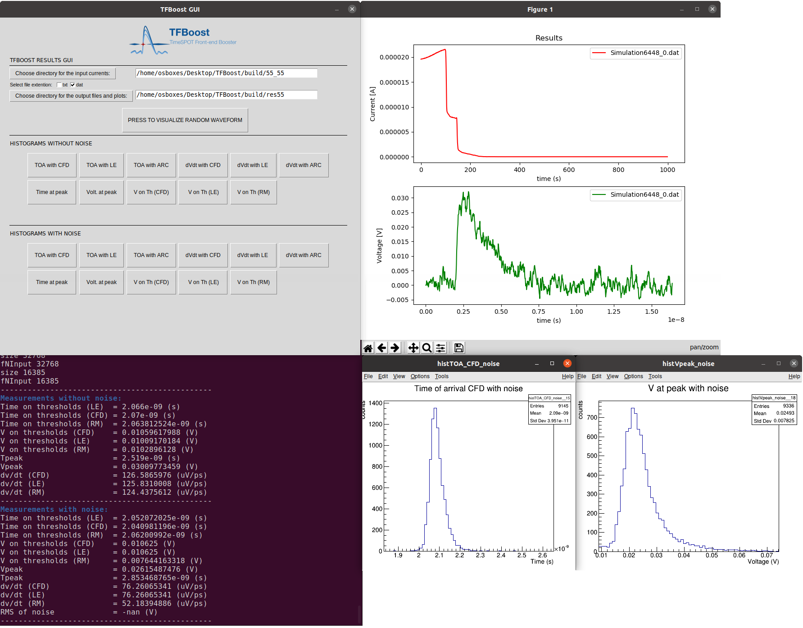

## TFBoost
[](https://www.gnu.org/licenses/gpl-3.0)


[](https://doi.org/10.5281/zenodo.4265385)


TFBoost is a C++14 compliant application, highly based on [HYDRA v.3](https://github.com/MultithreadCorner/Hydra) and mainly with a functional design, to perform the convolution between a signal (for example a voltage or current signal from a sensor) and a transfer function of a signal analyzer system (for example a readout electronics) in massively parallel platforms on Linux systems. The transfer function can be read from a file as a set of sampling points, or can be chosen from a set of analytical functions provided by the library and fully configurable. 
The available transfer functions are: 
- Two Transimpedance, with 1 and 2 stages, 
- CSA, 
- Ideal integrator, described as the input impedance of a CSA, 
- Order-n Butterworth filter. 

The input signals are read from files as a set of sampling points. The application performs also a set of measurements on the convoluted output signals such as: arrival time, with leading edge and constant fraction discrimination, maximum value and its corresponding time, slope and voltange on discrimination thresholds, etc. Morover a simulated noise, white or red, can be added to the output signal. The computation of the convolution can be turned off, and the set of measurements can thus be applied to real signals.

TFBoost has also a Graphical User Interface written in Python3:




Within the [TCoDe](https://github.com/MultithreadCorner/TCode) application, developed within the TIMESPOT collaboration to simulate the response of solid state sensors, TFBoost will be part of a complete software for simulation of signals in solid state detectors, from the generation in the sensor to the output of the readout electronics.


## Dependencies
TFBoost depends on [HYDRA >= v.3.2.1](https://github.com/MultithreadCorner/Hydra), [ROOT >= v.6.14](https://github.com/root-project/root), [libconfig >= v1.5](https://hyperrealm.github.io/libconfig/), [TCLAP >= v1.2.1](http://tclap.sourceforge.net/). For the best performances at least TBB or OMP backends are needed. Optionally  [CUDA >= 10.0](https://developer.nvidia.com/cuda-toolkit) is needed for nVidia GPUs. [GCC >= v.8](https://gcc.gnu.org/) is needed. 

The graphical user interface require Python3 and the packages: tkinter, filedialog, PIL, ImageTk, subprocess, os, math, pandas, webbrowser, random, matplotlib


## Disclaimer
TFBoost is currently an `alpha` version and is under development. Please report any problems throught GitHub Issues if necessary. The current design is in a preliminary stage, the final design will be composed of semi-independent modules and algorithms that can be instantiated and chained in run time, depending on the configuration provided by the user.


## Installation, Build and Run
The first step is checkout [HYDRA v.3](https://github.com/MultithreadCorner/Hydra) and TFBoost:
```bash
mkdir <TFBoostDev>
cd <TFBoostDev>
git clone https://github.com/MultithreadCorner/Hydra.git Hydra
git clone https://github.com/dbrundu/TFBoost.git TFBoost
```

Then you have to setup the proper enveironment variables:
```bash
export CC=/usr/bin/gcc-8
export CXX=/usr/bin/g++-8
export ROOTSYS=<path-to-root-build>
export HYDRA_INCLUDE_DIR=<path-to-hydra>
...
```

Starting from the TFBoost folder, please create a `build` directory for convenience and run the cmake command:
```bash
cd TFBoost
mkdir build
cd build
cmake -DHYDRA_INCLUDE_DIR=$HYDRA_INCLUDE_DIR ../
```

At this point you can run the examples: please read at the examples section for a description on how to setup and run them. If you want to run the actual application please setup the proper configuration using the file `configuration.cgf` inside the `etc/` folder, then build and run the application as:
```bash
make analysis_tbb
./analysis_tbb 
```
to build all the application needed for the GUI:
```bash
make analysis_tbb deconvolution_tbb resampling_tbb 3Ddiamond_tbb
```
to run TFBoost using the GUI, open a terminal in the folder 'TFBoost GUI' and type:
```bash
python3 TFBoostGui.py
```


## Build and Run the examples
An example of a simple analysis is available. The input files are obtained from an ideal silicon sensor and the files are in the `examples/input_files` directory. The configuration file named `config.cfg` is inside the `examples/` directory, while the rusults will be saved inside `<build>/results/`.  After the `cmake` command the example and can be run simply as:
```bash
make simple_analysis_tbb
./simple_analysis_tbb 
```

## Authors
TFBoost was created by [Davide Brundu](https://github.com/dbrundu) and [Gian Matteo Cossu](https://github.com/gianmatteocossu), within the TIMESPOT collaboration.


## Reporting and Contributing
There are different ways to report bugs, problems or to contribute in general. We prefer that any problem or possible bug is reported through GitHub issues. If you want to contribute to solve a bug or improve the code please open a Pull Request. For general questions on how to proper use the code, or any doubts, please contact directly the authors.

